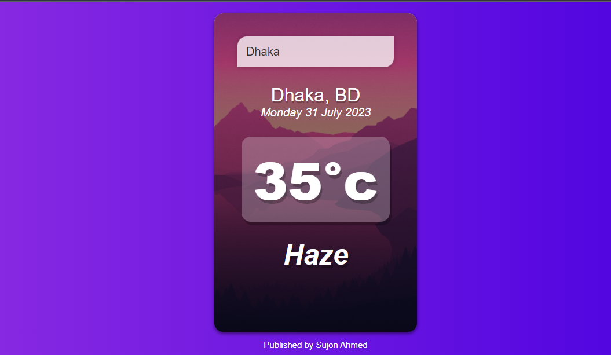

# vue-weather-app

Weather Forecasting using Vue.js, OpenWeatherMap



## Demo URL 
[https://sujon-vue-weather-app.netlify.app/](https://sujon-vue-weather-app.netlify.app/)

## Features
- Simple and responsive design
- [Vue.js v3](https://vuejs.org) Options API
- Any location Weather Forecasting

## Installation

1. ##### Make sure you have Node JS installed. If you don't have it:

-   [Download it from nodejs.org](https://nodejs.org)

## Project setup
#### Clone Project
```
git clone https://github.com/Sujon-Ahmed/vue-weather-app
```

#### Run Command

```
npm install
```

#### Compiles and hot-reloads for development
```
npm run serve
```
